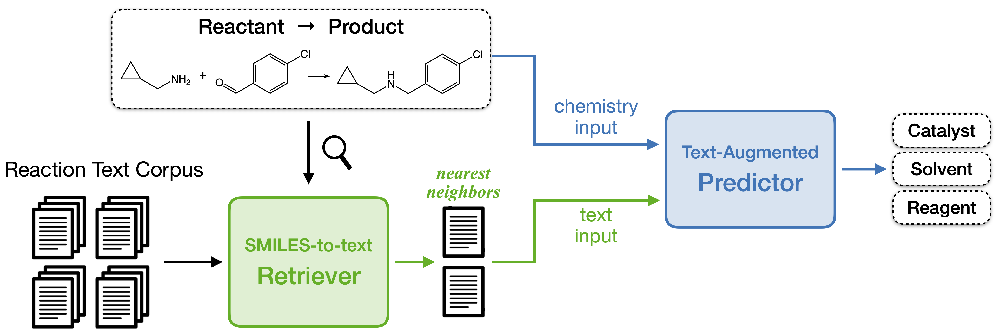

# TextReact

This repository contains the code for TextReact, a novel method that directly augments predictive chemistry with 
text retrieval.



```
@inproceedings{TextReact,
  author    = {Qian, Yujie and 
               Li, Zhening and 
               Tu, Zhengkai and 
               Coley, Connor W and 
               Barzilay, Regina},
  title     = {Predictive Chemistry Augmented with Text Retrieval},
  booktitle = {Proceedings of the 2023 Conference on Empirical Methods in Natural
                Language Processing, Singapore, December 6 - 10, 2023},
  publisher = {Association for Computational Linguistics},
  year      = {2018},
}
```

## Requirements
We implement the code with `torch==1.11.0`, `pytorch-lightning==2.0.0`, and `transformers==4.27.3`. 
To reproduce our experiments, we recommend creating a conda environment with the same dependencies:
```bash
conda env create -f environment.yml -n textreact
```

## Data

Run the following commands to download and unzip the preprocessed datasets:
```
git clone https://huggingface.co/datasets/yujieq/TextReact data
cd data
unzip '*'
```

## Training Scripts

TextReact consists of two modules: SMILES-To-text retriever and 
text-augmented predictor. This repository only contains the code for 
training the predictor, while the code for retriever is available in
a separate repository: https://github.com/thomas0809/tevatron.

The training scripts are located under [`scripts`](scripts).
The naming format of the scripts is `train_TASK_MODEL.sh` where
where:
- `TASK` specifies the task to train the model on:
`condition` for reaction condition recommendation (RCR) and `retro` retrosynthesis (RetroSyn)
- `MODEL` is the model to train and whether to use the random split or time split of the data:
`mlm` for TextReact on the random split, `transformer` for the Transformer baseline on the random split,
and `year` for TextReact on the time split.

If you're working on a distributed file system, it is recommended to change the `CACHE_PATH` variable
in the script to a local path to reduce network time.

To run the script `scripts/exp/train_TASK_MODEL.sh`, use the following command:
```
bash scripts/exp/train_TASK_MODEL.sh
```

At the end of training, a dictionary is printed with the top-k test accuracies.
For the TextReact model, two dictionaries are printed,
the first one corresponding to retrieving from the full corpus
and the second one corresponding to retrieving from the gold-removed corpus.

Models and test predictions are stored under the path specified by the `SAVE_PATH` variable in the script.
`best.ckpt` is the checkpoint with the highest validation accuracy so far, whereas
`last.ckpt` is the last checkpoint.
`prediction_test_0.json` contains predictions on the test set.
For the TextReact model, `prediction_test_0.json` contains the test predictions when retrieving from the full corpus,
whereas `prediction_test_1.json` contains the predictions when retrieving from the gold-removed corpus.
